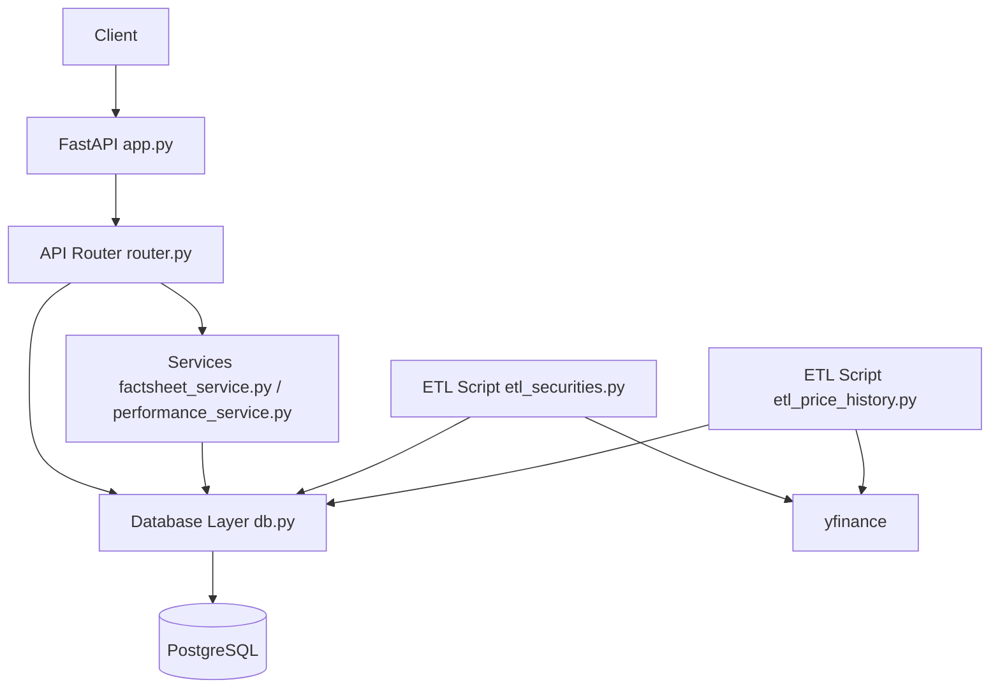

# Springstreet

Frontend: [https://springstreet.vercel.app/](https://springstreet.vercel.app/)  
Backend: [https://d4w33uyvhgoam.cloudfront.net](https://d4w33uyvhgoam.cloudfront.net)

## Setup Instructions

## Backend Setup

### Prerequisites

- Python 3.11+
- `uv`
- Docker

### Local Setup

```bash
cd backend
cp .env.example .env
uv sync
```

### Start Database (Docker)

```bash
docker run --name springstreet-postgres \
  -e POSTGRES_USER=postgres \
  -e POSTGRES_PASSWORD=postgres \
  -e POSTGRES_DB=springstreet \
  -p 5432:5432 \
  -d postgres:16
```

### Run Migrations

```bash
cd backend
uv run alembic upgrade head
```

### Start Backend

```bash
cd backend
uv run python main.py
```

## Frontend Setup

```bash
cd frontend
npm install
npm run dev
```

## ETL Setup

Run both ETL scripts from the `backend` directory:

```bash
cd backend
uv run python etl_securities.py
uv run python etl_price_history.py
```

Set cron jobs:

1. Open crontab:

```bash
crontab -e
```

2. Add entries (update paths as needed):

```cron
0 6 * * * cd /home/abhijeet/projects/personal/springstreet/backend && /usr/bin/env uv run python etl_securities.py >> /tmp/etl_securities.log 2>&1
30 6 * * * cd /home/abhijeet/projects/personal/springstreet/backend && /usr/bin/env uv run python etl_price_history.py >> /tmp/etl_price_history.log 2>&1
```

In simple terms: `etl_securities.py` runs every day at **6:00 AM**, and `etl_price_history.py` runs every day at **6:30 AM** (server local time).

## Backend Architecture

Springstreet backend is a FastAPI service. API routes live in `router.py`, data access is handled by `db.py`, and business logic for analytics/factsheet/performance is in service modules. Data is stored in Postgres, and ETL scripts keep `securities` and `price_history` updated from Yahoo Finance.



## Design Decisions

### Scope Assumptions

The assignment focuses on powering the Prisma factsheet experience rather than portfolio construction. Therefore, the system assumes that a product and its holdings already exist and are managed externally. The backend is responsible for ingesting market data, storing portfolio information, calculating analytics, and exposing APIs for the factsheet.

### Database Design

The database contains four core entities:

* `products` – investment products such as Prisma portfolios.
* `holdings` – portfolio composition and weights.
* `securities` – stock metadata fetched from Yahoo Finance.
* `price_history` – historical market data for performance calculations.

A conscious decision was made to store only source-of-truth data instead of storing derived analytics such as sector exposure, country exposure, market-cap exposure, or precomputed factsheets.

This keeps the data model normalized, avoids duplication, and guarantees that factsheet analytics are always derived from the latest available portfolio and market data.

### Factsheet Generation

Factsheet data is calculated dynamically at request time using data from `holdings`, `securities`, and `price_history`.

Examples include:

* Top holdings
* Sector exposure
* Country exposure
* Market-cap exposure
* Holdings count
* Largest holding

These values are derived directly from portfolio weights and security metadata rather than being persisted separately.

### Performance Calculation

Portfolio performance is calculated using weighted returns of the underlying holdings.

For each holding:

```
Stock Return = (Current Price - Historical Price) / Historical Price
```

Portfolio return is then computed as:

```
Portfolio Return = Σ(Holding Weight × Stock Return)
```

This approach allows the service to generate 1-month, 3-month, and 1-year performance metrics directly from historical price data.

### ETL Strategy

Yahoo Finance acts as the external data source.

Two independent ETL jobs are used:

* `etl_securities.py` updates security metadata such as sector, industry, country, currency, exchange, and market capitalization.
* `etl_price_history.py` updates historical price data used for portfolio analytics and performance calculations.

Separating these jobs keeps responsibilities clear and allows either dataset to be refreshed independently.

### Data Freshness

Market data is refreshed daily through scheduled cron jobs.

API requests never depend on live Yahoo Finance calls. Instead, they read exclusively from PostgreSQL. This improves reliability, avoids external API latency during requests, and ensures predictable response times.

### Scalability Considerations

The current design favors simplicity and maintainability while remaining easy to extend.

If portfolio count, holdings count, or traffic increase significantly, the following optimizations could be introduced:

* Redis caching for factsheet responses
* Materialized views for expensive aggregations
* Background computation of performance metrics
* Workflow orchestration using Airflow instead of cron jobs

These optimizations were intentionally excluded to keep the implementation aligned with the assignment scope while maintaining a clear upgrade path.
