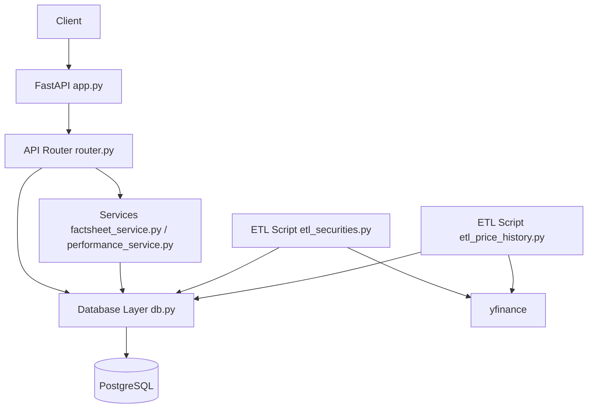

# Springstreet

Frontend: [https://springstreet.vercel.app/](https://springstreet.vercel.app/)  
Backend: [https://d4w33uyvhgoam.cloudfront.net](https://d4w33uyvhgoam.cloudfront.net)

## Backend Architecture

Springstreet backend is a FastAPI service. API routes live in `router.py`, data access is handled by `db.py`, and business logic for analytics/factsheet/performance is in service modules. Data is stored in Postgres, and ETL scripts keep `securities` and `price_history` updated from Yahoo Finance.



## Setup Instructions

## Backend Setup

### Prerequisites

- Python 3.11+
- `uv`
- Docker

### Local Setup

```bash
cd backend
cp .env.example .env
uv sync
```

### Start Database (Docker)

```bash
docker run --name springstreet-postgres \
  -e POSTGRES_USER=postgres \
  -e POSTGRES_PASSWORD=postgres \
  -e POSTGRES_DB=springstreet \
  -p 5432:5432 \
  -d postgres:16
```

### Run Migrations

```bash
cd backend
uv run alembic upgrade head
```

### Start Backend

```bash
cd backend
uv run python main.py
```

## ETL Setup Instructions

Run both ETL scripts from the `backend` directory:

```bash
cd backend
uv run python etl_securities.py
uv run python etl_price_history.py
```

Set cron jobs:

1. Open crontab:

```bash
crontab -e
```

2. Add entries (update paths as needed):

```cron
0 6 * * * cd /home/abhijeet/projects/personal/springstreet/backend && /usr/bin/env uv run python etl_securities.py >> /tmp/etl_securities.log 2>&1
30 6 * * * cd /home/abhijeet/projects/personal/springstreet/backend && /usr/bin/env uv run python etl_price_history.py >> /tmp/etl_price_history.log 2>&1
```

In simple terms: `etl_securities.py` runs every day at **6:00 AM**, and `etl_price_history.py` runs every day at **6:30 AM** (server local time).
